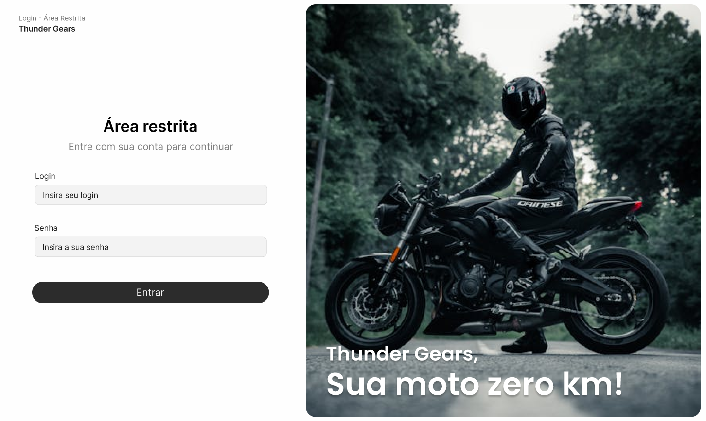

# 🏍 Thunder Gears



[Sobre](#-sobre) • [Como Rodar](#-como-rodar) • [Construção](#-construção-do-projeto) • [Desafios](#-desafios-vencidos) • [Tecnologias](#-tecnologias-usadas) • [Autores](#-autores)


## 💬 Sobre
> Projeto _Fullstack_ que faz o gerenciamento de estoque e venda para a loja de motos - fictícia - *Thunder Gears*. O sistema tem como objetivo ajudar a fazer o gerenciamento de estoque e venda de motos.

## 🚀 Como rodar

> *1.* Clone o projeto para a sua máquina

````bash
$ git clone https://github.com/ItaloBrazucaDeveloper/Thunder-Gears.git
$ cd Thunder-Gears
````

> *2.* Copie e cole o arquivo .env.example e renomeie para .env

````bash
$ cp .env.example .env
````

> *3.* Insira as variáveis de ambiente no arquivo .env

```bash
DB_HOST=nome_do_servidor
DB_NAME=nome_do_banco
DB_USER=seu_usuario
DB_PASS=sua_senha
DB_PORT=porta_do_servidor

LOGIN=seu_usuario
SENHA_LOGIN=sua_senha
```

## 🔥 Construção do projeto
> A seguir nosso processo criativo para construir o projeto:

0. Decidimos as ferramentas, a estrutura do projeto - considerando o tempo que tinhamos para fazer o projeto.
1. Pesquisamos os requisitos funcionais, não funcionais e regras de négocio que poderiamos ter em um sistema de gestão de estoque e venda - para uma loja de motos.
2. Organizamos quem faria cada tarefa do projeto.
3. Criamos um modelo conceitual e lógico do banco de dados.
4. Criamos a estrutura de pastas do projeto com arquivos iniciais.
5. Começamos a fazer o código back-end do projeto.
6. Começamos a fazer o design das páginas do projeto.
7. Começamos a fazer o código front-end do projeto.

## 😃 Desafios vencidos
> Quais desafios foram vencidos?

## 👅 Tecnologias usadas
> Quais linguagens foram usadas?

- HTML 5
- CSS 3
- PHP 8
- SQL

> Quais ferramentas foram usadas?

- MariaDB - SGBD
- Bootstrap - Criação de layout
- Visual Studio Code - Codificação
- Notion - Organização e documentação
- Figma - Design das páginas

## 👨‍💻 Autores
- [Ítalo](https://github.com/ItaloBrazucaDeveloper) - Tech Lead
- [Benício](https://github.com/Dev-Benicio) - Backend Coder
- [Daniel](https://github.com/Niel-De) - Database Administrator
- [João](https://github.com/NegoCodeHacker) - Frontend
